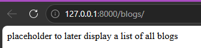
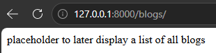
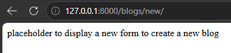
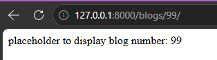
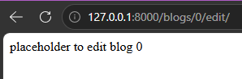
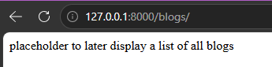
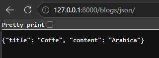

# First Django Project

A simple Django routing project built to practice:

* Creating a Django project and app
* URL routing
* Redirects
* Route parameters
* JsonResponse
* Views and HttpResponse

---

# Technologies Used

* Python
* Django 6
* VS Code

---

# Project Structure

```bash
first_Django/
│
├── manage.py
├── db.sqlite3
├── README.md
│
├── first_Django/
│   ├── settings.py
│   ├── urls.py
│   └── ...
│
└── main_app/
    ├── views.py
    ├── urls.py
    ├── static/
    │   └── images/
    └── ...
```

---

# Routes Implemented

| Route                     | Description                            |
| ------------------------- | -------------------------------------- |
| `/`                       | Redirects to `/blogs`                  |
| `/blogs/`                 | Displays placeholder for all blogs     |
| `/blogs/new/`             | Displays placeholder form for new blog |
| `/blogs/create/`          | Redirects to `/`                       |
| `/blogs/<number>/`        | Displays selected blog number          |
| `/blogs/<number>/edit/`   | Displays edit placeholder              |
| `/blogs/<number>/delete/` | Redirects to `/blogs`                  |
| `/blogs/json/`            | Returns JsonResponse                   |

---

# Screenshots

## Landing Route Redirect



---

## Blogs Route



---

## New Blog Route



---

## Blog Number Route



---

## Edit Blog Route



---

## Delete Blog Redirect



---

## JsonResponse Route



---

# Running The Project

Activate virtual environment:

## Windows CMD

```bash
djangoPy3Env\Scripts\activate
```

Run server:

```bash
python manage.py runserver
```

Open in browser:

```bash
http://127.0.0.1:8000/
```

---

# Concepts Practiced

* Django routing
* Views
* HttpResponse
* Redirects
* Route parameters
* JsonResponse
* App structure
* URL patterns
