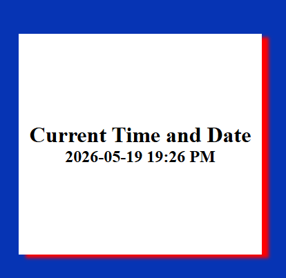

# Time Display

A simple Django project that displays the current date and time using Django views, templates, and static files.

---

# Technologies Used

- Python
- Django 6
- HTML
- CSS

---

# Features

- Displays current date and time dynamically
- Uses Django templates
- Passes data from views to HTML using context
- Includes custom CSS styling
- Uses static files correctly

---

# Project Structure

```bash
time_display/
│
├── manage.py
├── db.sqlite3
├── README.md
│
├── time_display/
│   ├── settings.py
│   ├── urls.py
│   └── ...
│
└── display_time/
    │
    ├── views.py
    ├── urls.py
    ├── templates/
    │   └── index.html
    │
    └── static/
        ├── style.css
        └── landing_page.png
```

---

# Current Time Logic

The project uses Python time functions:

```python
from time import gmtime, strftime
```

and passes the formatted time to the template through a context dictionary.

---

# Screenshot



---

# Running The Project

## Activate Virtual Environment (Windows CMD)

```bash
djangoPy3Env\Scripts\activate
```

## Run the Server

```bash
python manage.py runserver
```

## Open in Browser

```bash
http://127.0.0.1:8000/
```

---

# Concepts Practiced

- Django project setup
- Django app setup
- URL routing
- Views
- Templates
- Context dictionaries
- Static files
- CSS styling
- Dynamic time rendering
