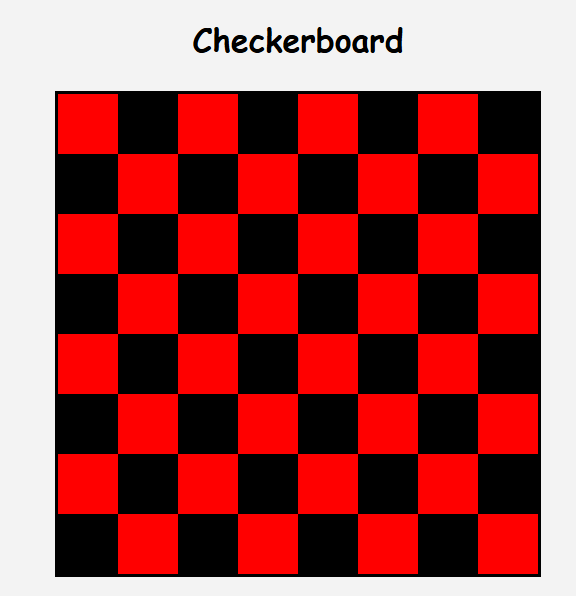

# Checkerboard Assignment

## Overview

This project is a Flask application that dynamically generates a checkerboard using HTML, CSS, Jinja, and Flask routing.

The checkerboard size and colors can be customized directly from the URL.

---

# Features

## Default Route

### URL

```bash
http://localhost:5000
```

Displays an 8x8 checkerboard.

---

## Dynamic Rows

### URL

```bash
http://localhost:5000/<x>
```

### Example

```bash
http://localhost:5000/4
```

Displays a checkerboard with 4 rows and 4 columns.

---

## Dynamic Rows and Columns

### URL

```bash
http://localhost:5000/<x>/<y>
```

### Example

```bash
http://localhost:5000/10/10
```

Displays a checkerboard with custom rows and columns.

---

## Dynamic Colors (Bonus)

### URL

```bash
http://localhost:5000/<x>/<y>/<color1>/<color2>
```

### Example

```bash
http://localhost:5000/10/10/blue/yellow
```

Displays a checkerboard with custom rows, columns, and colors.

---

# Technologies Used

- Python
- Flask
- HTML5
- CSS3
- Jinja2

---

# Project Structure

```bash
checkerboard/
│
├── server.py
├── README.md
├── static/
│   ├── style.css
│   └── board.png
│
└── templates/
    └── index.html
```

---

# Screenshots

## Checkerboard Preview



---

# How to Run the Project

## Activate Virtual Environment

```bash
mySntv\Scripts\activate
```

## Run the Flask Server

```bash
python server.py
```

## Open in Browser

```bash
http://localhost:5000
```

---

# Learning Objectives

- Practice Flask routing
- Pass URL parameters to routes
- Use Jinja loops and conditions
- Link static CSS files
- Build dynamic HTML content using Flask templates