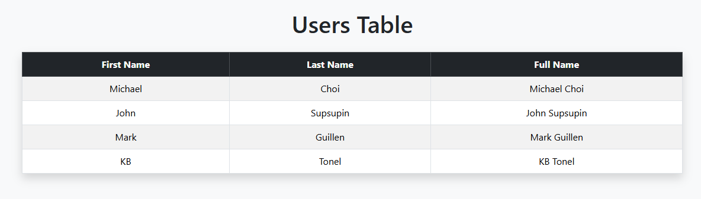

# HTML Table Assignment

## Overview

This project is a Flask application that displays user information inside a dynamic HTML table using Jinja templating.

The application demonstrates how to:

- Pass data from Flask routes to templates
- Iterate through a list of dictionaries
- Render dynamic HTML content
- Use Bootstrap to style tables professionally

---

# Features

## Main Route

### URL

```bash
http://localhost:5000
```

Displays a table containing:

- First Name
- Last Name
- Full Name

---

# Technologies Used

- Python
- Flask
- HTML5
- Bootstrap 5
- Jinja2

---

# Project Structure

```bash
html_table/
│
├── server.py
├── README.md
│
├── static/
│   └── table.png
│
└── templates/
    └── index.html
```

---

# Screenshot

## Table Preview



---

# How to Run the Project

## Activate Virtual Environment

```bash
mySntv\Scripts\activate
```

## Run Flask Server

```bash
python server.py
```

## Open in Browser

```bash
http://localhost:5000
```

---

# Learning Objectives

- Practice passing data from Flask to templates
- Work with lists of dictionaries
- Use Jinja loops
- Build structured HTML tables
- Improve UI using Bootstrap