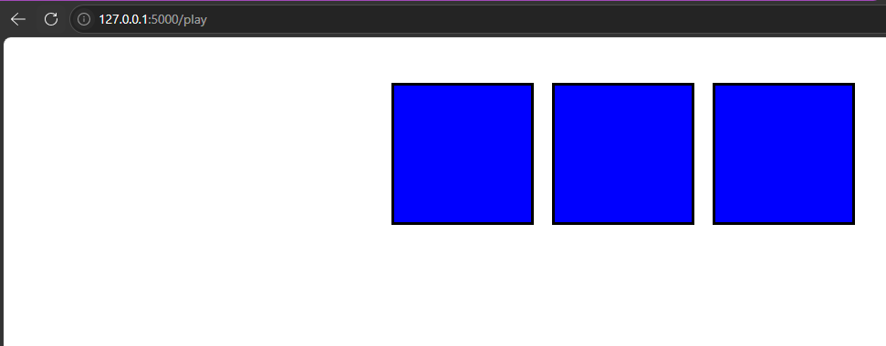
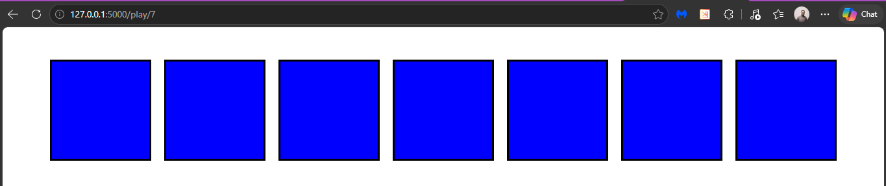
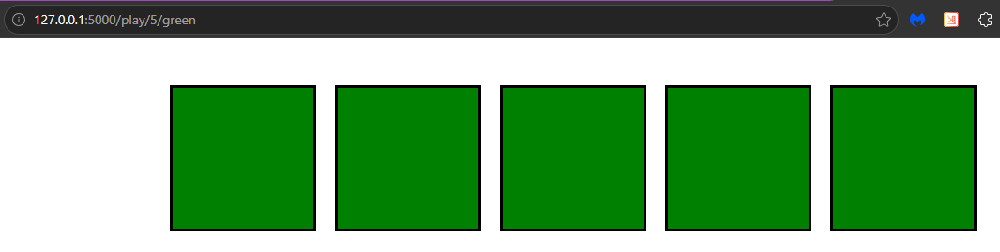

# Playground - Flask Assignment

## Overview

This project is a simple Flask application that demonstrates how to:

* Pass data from routes to templates
* Use dynamic route parameters
* Render content using Jinja templates
* Use loops and conditions in HTML templates
* Style elements using internal CSS

The application generates colorful boxes dynamically based on the URL.

---

# Features

## Level 1

### Route

```bash
/play
```

Displays **3 blue boxes**.



---

## Level 2

### Route

```bash
/play/<x>
```

### Example

```bash
/play/7
```

Displays **x number of blue boxes**.



---

## Level 3

### Route

```bash
/play/<x>/<color>
```

### Example

```bash
/play/5/green
```

Displays **x number of boxes** using the selected color.



---

# Project Structure

```bash
playground/
│
├── server.py
├── templates/
│   └── index.html
├── static/
│   └── images/
│       ├── play.png
│       ├── play-7.png
│       └── play-green.png
│
└── README.md
```

---

# Technologies Used

* Python
* Flask
* HTML5
* CSS3
* Jinja2

---

# How To Run The Project

## 1. Install Flask

```bash
pip install flask
```

## 2. Run The Server

```bash
python server.py
```

## 3. Open In Browser

```bash
http://localhost:5000/play
```

---

# What I Learned

Through this assignment, I practiced:

* Creating Flask routes
* Passing variables to templates
* Using Jinja loops
* Creating dynamic HTML content
* Building reusable templates
* Styling pages with CSS

---

# Screenshots Folder

Create an `images` folder inside the `static` folder and add your screenshots:

```bash
mkdir static\images
```

Suggested screenshot names:

```bash
play.png
play-7.png
play-green.png
```

---

# Author

Abdallah Awwad
